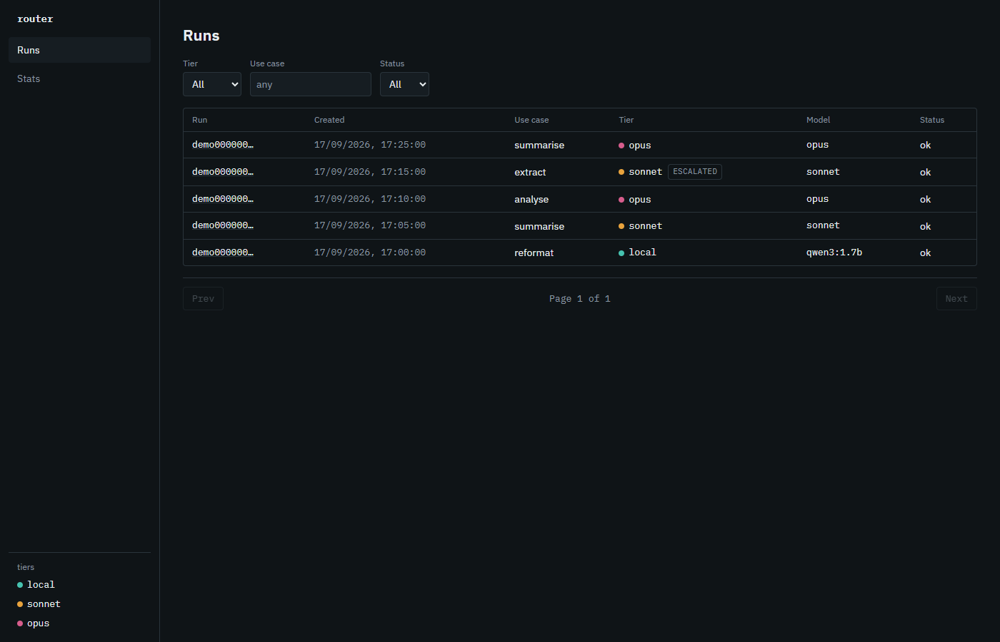
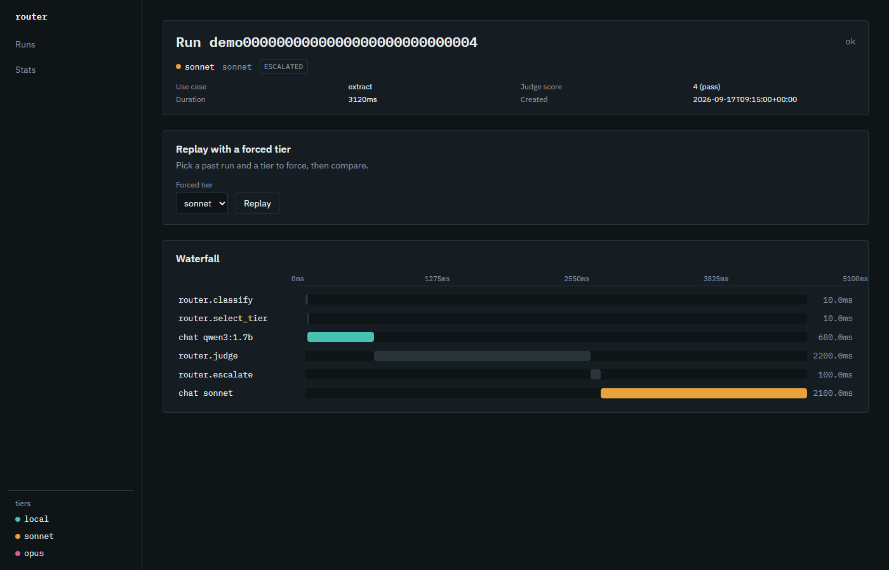
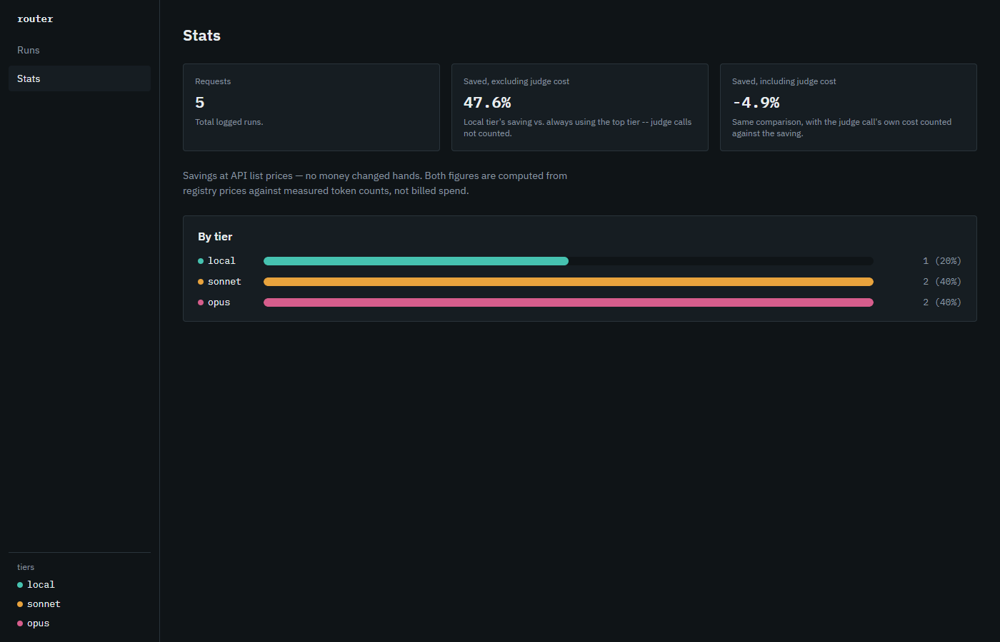
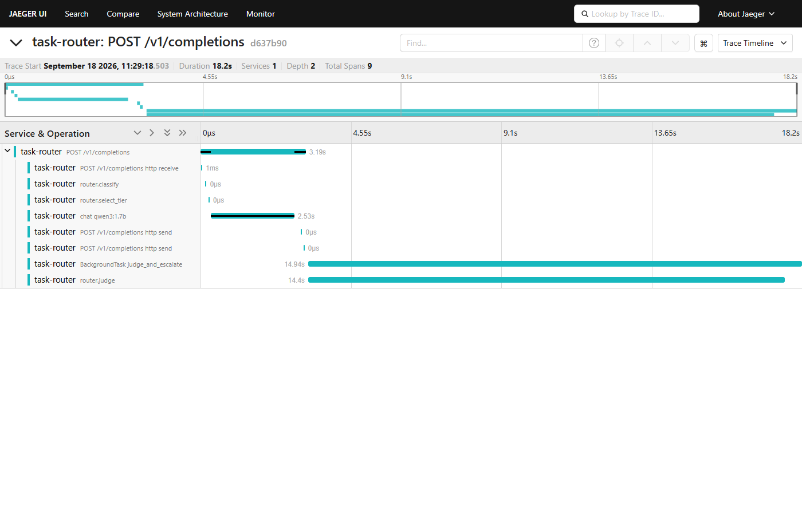

# task-router

A solo developer who pays for one LLM subscription and writes small scripts
against it (a changelog formatter, a data cleaner, a quick classifier) has
no reason to send every one of those requests to the same expensive model.
task-router classifies each request with a cheap, surface-feature model,
routes it to a local/Sonnet/Opus tier by default, catches a bad cheap-tier
answer with an async judge one tier above, and escalates only when needed.
Every request is logged with a full OpenTelemetry trace, so the routing
decision behind a request is something you can inspect, not just a bill.

## The differentiator

This is a routing-pipeline replay debugger. Phoenix's Span Replay and
Langfuse's Playground already let you take a stored prompt and re-run it
against a different model, swapping the model on a saved span. Neither of
them replays the router's own decision.

`POST /replay {source_run_id, forced_tier}` re-runs the entire pipeline
(classify, select_tier, answer, judge, escalate) against a stored request,
with `select_tier`'s output overridden to the forced tier instead of
whatever the classifier originally picked. The classifier still runs, so
its original call is visible in the diff even though it's overridden, and
escalation can still fire on the forced-tier answer. The result is a new
run, diffed against the original. It's not treated as a corrected version
of the original, because replay is not deterministic: model outputs vary
call to call, so replaying the same run twice can produce two different
answers, scores, and escalation outcomes. See
[ADR 0002](docs/adr/0002-replay-forced-tier-diff.md) for the full
reasoning, including why span-only replay was rejected as duplicating
tooling that already exists.

## Screens


Runs list, each row colored by tier, with an escalated badge where the
judge kicked a request up.


Per-run span waterfall (`classify` → `select_tier` → `chat` → `judge` →
`escalate`), with the replay-and-diff panel below it.


Stats page from the synthetic demo fixture (`data/fixtures/demo.sqlite`),
not the real battery run below. It shows savings two ways, with and without
the judge call's own cost folded in; see Results below for the real
numbers.

## Architecture

```
request → [router.classify]  8 surface features, no model call
              │                (length, verbs, constraints, context,
              │                 output format, reasoning words, questions,
              ▼                 numeric tokens, Tech_Scope.md §2)
        [router.select_tier]  LogisticRegression picks local / sonnet / opus
              │
              ▼
        [chat <model>]  the picked tier answers, caller gets this back now;
              │          nothing below this line blocks the response
              ▼
   ┌── background ──────────────────────────────────────────────┐
   │  [router.judge]  the tier ONE ABOVE the answering tier      │
   │       scores the answer 1-5 (sampled at judge_sample_rate). │
   │       Local is judged by sonnet, sonnet by opus; opus is    │
   │       never judged (no tier above it to judge with).        │
   │              │                                              │
   │              ▼ (score below the use case's threshold)       │
   │       [router.escalate]  one tier up, never straight to the │
   │       top; the escalated answer replaces the original       │
   └──────────────────────────────────────────────────────────── ┘
              │
              ▼
   every span above is written to SQLite (runs + spans tables) via a
   custom OTel SpanExporter. This is the trace and the audit record.
```

The React UI reads that same SQLite data through a read-only API: a runs
list, a span waterfall per run (with an attribute drawer), a replay-and-diff
panel, and a stats page (savings shown two ways, see Honesty below). See
[`docs/Tech_Scope.md`](docs/Tech_Scope.md) for the full data model and API
contract, and [ADR 0001](docs/adr/0001-judge-tier-above-sampled.md) for why
the judge is tier-above rather than a fixed all-Opus judge or same-tier
self-grading.

## Run in 3 commands

Three processes, each in its own terminal.

**1. Backend** (FastAPI + SQLite, from the repo root):

```
uv run uvicorn api:app
```

**2. Local model** (Ollama, for the local tier):

```
ollama serve
ollama pull qwen3:1.7b
```

`qwen3:1.7b` runs with thinking mode explicitly forced off
(`local_request.py` pins `"think": false`). Left on, hidden reasoning
tokens would inflate the exact latency and cost numbers this project exists
to report honestly.

**3. UI** (Vite + React + TS):

```
cd ui
npm install
npm run dev
```

The backend allows cross-origin requests from the Vite dev server
(`http://localhost:5173` / `http://127.0.0.1:5173`) by default; set
`CORS_ALLOW_ORIGINS` (comma-separated) to override that list.

### Environment variables

| Variable | Default | Used by |
|---|---|---|
| `TASK_ROUTER_DB` | `data/audit.sqlite` | `api.py` / `db.py`: which SQLite file the backend reads and writes. Point this at `data/fixtures/demo.sqlite` to run the UI against the committed demo data with nothing else running (see below). |
| `OLLAMA_HOST` | `http://localhost:11434` | `providers.py`: where the local-tier `/api/chat` call goes. |
| `REGISTRY_PATH` | `registry.yaml` | `registry.py`: the tier/model/price table. |
| `ROUTING_CONFIG_PATH` | `routing.yaml` | `routing_config.py`: tier map, judge sample rate, per-use-case thresholds. |
| `VITE_API_BASE` | `http://localhost:8000` | `ui/src/api/client.ts`: where the UI's read API calls go. |
| `CORS_ALLOW_ORIGINS` | `http://localhost:5173,http://127.0.0.1:5173` | `api.py`: comma-separated origins allowed to call the backend from a browser. |

### Demo with no model running

The committed fixture at `data/fixtures/demo.sqlite` has synthetic (not
real) runs across all three tiers, including one escalation and one replay
pair, so the UI is fully populated without Ollama or a Claude subscription
on hand:

```
TASK_ROUTER_DB=data/fixtures/demo.sqlite uv run uvicorn api:app
```

Then start the UI as above. Regenerate the fixture with
`uv run python scripts/make_demo_fixture.py`, which deterministically
rebuilds the same rows every time. `tests/test_demo_fixture.py` checks the
committed file matches what the script currently produces.

## Honesty

These are the constraints this project is built to be honest about, not
just implementation details.

- **No real money.** Every cloud call runs on the operator's existing Max
  subscription via an unmodified `claude -p` (never `--bare`, which would
  silently switch to metered API-key billing). Every savings figure in this
  README and in `GET /v1/stats` is computed at `registry.yaml`'s API list
  prices, prices that were never actually billed. See
  [ADR 0003](docs/adr/0003-provider-auth-subscription-with-apikey-slot.md).
- **Savings are reported two ways.** A local-tier answer that gets judged
  by Sonnet still cost one Sonnet call, so `saved_pct_excl_judge` and
  `saved_pct_incl_judge` are both returned by `GET /v1/stats`, side by
  side. Leaving judge cost out would overstate the local tier's saving.
- **Classifier: 200 labelled (82 hand + 118 judge-derived), held-out 50,
  5-fold CV 0.525 ± 0.047.** All 200 drafted prompts are labelled: 82 by
  hand (the original 60, plus 30 the operator hand-corrected to `opus`
  afterward, see Results below), and 118 more by `auto_label.py`, which
  routed each unlabelled prompt to the local tier and escalated it until
  the tier above passed the judge, then recorded the cheapest passing
  tier. `data/prompts.json` marks each row's `tier_source` as `hand` or
  `judge_auto`, so the 82 hand labels stay distinguishable from the 118
  derived ones. Tier totals: local 102, sonnet 57, opus 41. On a seeded
  25% held-out split (50 ids), accuracy is 0.460. Five-fold
  cross-validation gives 0.525 ± 0.047. Held-out confusion matrix (rows
  and columns ordered local/opus/sonnet): `[[14,5,7],[5,2,3],[6,1,7]]`.
  This is not an improvement or regression claim against the earlier
  0.645 ± 0.058: the label mix changed (30 rows moved to hand-labelled
  opus, mostly off `judge_auto`), so the held-out and CV numbers moved
  with the mix, not because of any change to the training code. The 8
  surface features remain only moderately predictive of tier. One more
  caveat: 118 of the 200 labels still come from a model judge grading a
  model's own answers, so this accuracy is measured partly against
  model-derived ground truth, not human ground truth. `tier_source` is
  what lets a future analysis separate the two. There is no v1-to-v2
  improvement claim anywhere in this project.
- **The classifier does not catch traps; the judge does.** The 8 features
  are surface-only (length, verb count, punctuation, and the like) by
  design. A trap prompt is built to score like an easy one on exactly those
  numbers, so logistic regression structurally cannot flag it. Trap
  detection is the judge's job, scoring the actual answer, not the
  classifier's, scoring the prompt. See
  [ADR 0001](docs/adr/0001-judge-tier-above-sampled.md).
- **The judge is always the tier above, sampled, never self-grading.**
  Local answers are judged by Sonnet, Sonnet answers by Opus, Opus answers
  are unjudged (there's no tier above Opus). Same-tier judging was
  considered and rejected for the self-grading bias it introduces (ADR
  0001, "Alternatives Considered").
- **Local demo only.** This runs on one person's own machine against their
  own subscription; there is no hosted deployment. The provider interface
  has a slot for `ANTHROPIC_API_KEY`-based auth so a future hosted variant
  could swap providers without touching the router or classifier, but that
  path is implemented and unit-tested against a fake provider only, never
  exercised against a real endpoint. See
  [ADR 0003](docs/adr/0003-provider-auth-subscription-with-apikey-slot.md).

## Results (measured)

Two battery runs exist. Both ran for real on the operator's own Max
subscription (`claude -p`, never `--bare`); both are reported at
`registry.yaml`'s list prices, nothing actually billed (see Honesty
above).

| | Run A (60 hand labels) | Run B (200 labels, retrained) |
|---|---|---|
| Prompts | 60 | 200 (201 runs recorded, 1 duplicate row) |
| Failures | 0 | 0 |
| Routed tiers | local 27 / sonnet 26 / opus 7 | local 120 / sonnet 73 / opus 8 |
| Escalations | 17 | 46 |
| Saved, excl. judge | **-11.6%** | **+50.9%** |
| Saved, incl. judge | **-68.6%** | **+8.1%** |

### Post-Run-B: 30 more hand-labelled opus prompts (not yet re-scored)

After Run B, the operator reviewed a worksheet of judge_auto-labelled
prompts and hand-confirmed 30 of them as `opus`, mostly reasoning and
judge-facing prompts the auto-labeller had under-routed. `data/prompts.json`
now has 82 hand labels and 118 judge-derived labels, up from 60/140, and
the classifier was retrained on the new mix (new held-out and CV numbers
are in Honesty above). Because those 30 labels came from the operator
instead of the judge, a re-score run against this hand-corrected mix
would remove most of Run B's circularity for the opus tier specifically.
**That re-score has not been run yet.** The Run A and Run B numbers in
the table and sections below are unchanged and still reflect the
classifier as it stood before this correction.

### Run A: 60 hand labels (earlier)

All 60 requests completed; 0 failures. Final tier, after any escalation:
local 27, sonnet 26, opus 7. Seventeen requests escalated: 11 reached a
confirmed-passing Sonnet answer, and 6 escalated all the way to Opus.

The judge scored 58 of the 60 answers (Opus answers are never judged, see
Honesty above, which accounts for most of the 2 not scored). Scores: 5.0
on 40 answers, 4.0 on 11, 3.0 on 6, 1.0 on 1.

- Excluding judge cost: **-11.6%**. Answer calls cost $0.079, escalation
  calls cost $0.247, for $0.327 total, against an all-Opus baseline of
  $0.293.
- Including judge cost: **-68.6%**. Adding $0.167 of judge calls brings the
  total to $0.493, against the same $0.293 baseline.

On this run, the router cost more than sending every request straight to
Opus. That's the honest result, stated plainly, not spun.

#### Why Run A cost more, not less

1. `judge_sample_rate` was set to 1.0 for this run (proof mode: every
   request judged, not sampled). Each judge call sends the prompt and
   answer to the tier above, so judge cost alone is about 57% of the whole
   all-Opus baseline by itself. Production use would sample instead, for
   example 0.1 to 0.2.
2. The classifier was still weak (60 labels total, only 2 labelled opus),
   so it under-routed: 17 escalations, 6 of them all the way to Opus. Each
   of those pays for the cheap answer and the escalated answer.
3. The all-Opus baseline is estimated from each request's routed-answer
   token counts, not from a real Opus call made per request. That
   under-counts what all-Opus would actually cost and biases the
   comparison against the router.

### Run B: 200 labels, retrained classifier (new)

The classifier was retrained on all 200 labels (60 hand + 140
judge-derived via `auto_label.py`; see Honesty above). This re-score then
ran all 200 labelled prompts against that retrained classifier: 201 runs
recorded (one duplicate row), 0 failures across the 200 prompts.

Final tier, after any escalation: local 120, sonnet 73, opus 8.
Forty-six requests escalated.

Judge scores: 5.0 on 140 answers, 4.0 on 46, 3.0 on 6, 2.0 on 4, 1.0 on 2.

- Excluding judge cost: **+50.9%**.
- Including judge cost: **+8.1%**.

Both figures are positive even with `judge_sample_rate` still at 1.0 (every
request judged, the worst case for the included-judge figure; see Honesty
above).

#### Why Run B flipped positive

The retrained classifier has learned enough about the opus tier to route
about 60% of requests to the free local tier, and the judge accepts most
of those answers. That leaves far fewer escalations relative to the
all-Opus baseline than Run A had, so the router comes out ahead instead of
behind.

#### The catch: Run B is partly self-referential

The 140 judge-derived labels were produced by the same judge that scores
this battery: each one is the cheapest tier whose answer that judge
accepted. And the judge is lenient here: 186 of the 198 scored answers
came back at 4 or above. So the classifier was trained to route toward
tiers this judge already accepts, and the same judge then accepts them
again at scoring time. The local-heavy routing behind the +50.9% figure is
circular to that extent.

**Run A, measured on 60 independent hand labels, is the more trustworthy
figure for real-world saving.** The true saving is probably somewhere
between Run A's -11.6% and Run B's +50.9%. Settling it needs either a
stricter or independent judge, or more hand labels in place of the
judge-derived ones.

### What would change this

More independent hand labels, especially opus ones, would let the
classifier learn `opus` without leaning on the judge's own leniency. A
judge sample rate below 1.0 would also change the incl-judge figure
directly for both runs, since judge cost is a large share of it either
way. Neither change has been made here on purpose: the point of these
runs is to show the tool correctly measuring both a case where routing
pays off and one where it doesn't, not to report a single headline saving.
This project's value is the honest measurement, the full instrumentation,
and the routing-pipeline replay debugger, not either number on its own.

### Classifier: v1 vs v2, no improvement claim

Same seeded held-out ids for both, about 15 items.

| | Held-out accuracy | 2-fold CV |
|---|---|---|
| v1 | 0.80 | 0.70 ± 0.03 |
| v2 (+11 weighted feedback rows) | 0.40 | 0.465 ± 0.008 |

v2 did not improve on v1. The 11 sonnet-weighted feedback rows, added from
this run's escalations, pushed the classifier toward sonnet, which hurt it
on this small held-out set. That's expected, not a bug: feedback like this
mainly helps on near-duplicate prompts, and can hurt accuracy on a
held-out set this small (`docs/Product_Scope.md` §4;
`docs/research/REFUTATIONS.md` #13/#14).

### Reproduce

```
uv run python battery.py --db-path data/battery.sqlite
uv run python feedback.py --db-path data/battery.sqlite
uv run python train.py --version 2
```

## Jaeger (trace waterfall via an OTLP collector)

The custom SQLite exporter (`tracing.py`) is what the UI's own waterfall
page reads from, so Jaeger isn't required to use this project. The same
spans can optionally dual-export to any OTLP collector, Jaeger included,
for a second view of the same trace:

1. `docker run -d --name jaeger -p 16686:16686 -p 4318:4318 jaegertracing/all-in-one:latest`
2. Install the OTLP exporter extra first -- it's optional and not part of
   the core dependencies: `uv sync --extra otlp`.
3. `set OTEL_EXPORTER_OTLP_ENDPOINT=http://localhost:4318` (PowerShell:
   `$env:OTEL_EXPORTER_OTLP_ENDPOINT = "http://localhost:4318"`), then start
   the backend as above. `tracing.py` only imports the OTLP exporter
   package when this variable is set, so it costs nothing when unset --
   but it must be installed first (step 2) or setting the endpoint raises
   a clear error telling you to run that command.
4. Make a request: `POST /v1/completions` with a `prompt` and `use_case`.
5. Open `http://localhost:16686`, select service `task-router`, and find
   the trace: `router.classify` → `router.select_tier` → `chat <model>` →
   `router.judge` → `router.escalate` as a waterfall.


A single request's trace in Jaeger, 9 spans: `router.classify` →
`router.select_tier` → `chat <model>` → `router.judge` →
`router.escalate`.

## Docs

- [`docs/Product_Scope.md`](docs/Product_Scope.md): what this is and why
- [`docs/Tech_Scope.md`](docs/Tech_Scope.md): stack, data model, API
  contract, vertical slices
- [`docs/adr/0001-judge-tier-above-sampled.md`](docs/adr/0001-judge-tier-above-sampled.md): why the judge is tier-above, sampled
- [`docs/adr/0002-replay-forced-tier-diff.md`](docs/adr/0002-replay-forced-tier-diff.md): why replay re-runs the whole pipeline, non-deterministically
- [`docs/adr/0003-provider-auth-subscription-with-apikey-slot.md`](docs/adr/0003-provider-auth-subscription-with-apikey-slot.md): subscription auth now, API-key slot for later
- [`knowledge/`](knowledge): OKF knowledge bundle
